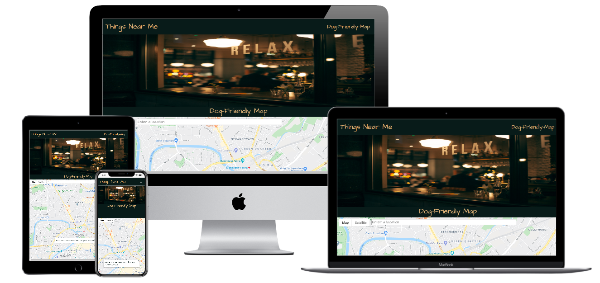
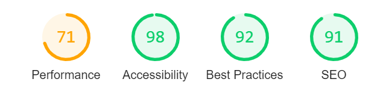

# Things Near Me 

This is a website that accesses the users location to show  Dog friendly :

* Cafes

* Bars/restaurants

* Parks 

As  a Dog owner I struggle finding appropiate places that i can take my  dog so i decided to make a
website that does just that , in a eye catching a pleasing way.

## UX
 
### This website is for:

* Dog owners 

### What they want to achieve:
* Learn What the website is about 

* See a location based map that states where they are 

* To see locations around them on the map marked by markers

* To see the business details when the marker is clicked 

* A website of said business so they can get necessary information

* Have street view so they know exactly what the street and business looks like from the from the road

*	(Most important) do it in a time efficient way 

### How will they achieve it:
* By making my website mobile first I can achieve a suitable layout of the website across all platforms just for the instance a user looks at it on mobile/tablet/desktop 

*	The first page will contain a about the website features  

*	There will be different pages so a user can jump from to the most relevant information 

*	when the map is loaded there is a clear pop up asking for location acess and when allowed it will zoom in and state 'YOU ARE HERE' marker added to the map 

*   Once the map has zoomed in on the users location the custom markers will drop and show neraby businesses

*   Once those custom markers are clicked the business information willn load into a side bar

*  This side bar will show the Picture , The rating , the address and the website of the business

*  Like the usual google maps there is a draggable icon near the zoom buttoms which you can drag onto your chosen street to view street view
### Wireframes 

For this I used balsamiq please find the pdf in the [Wireframes](Wireframes/Things-Near-Me.pdf)

## Existing Features 
*	Navigation bar- allows all users to select the content they want to view by simply clicking them , this also collapses into a toggle on mobile devices to maintain space 

*	Subheadings-this allows users find the information they need 

*	Location based map- this allows users see exactly where they are on the map in a clear manner
*	custom markers - can easily see nearby businesses
*	zoom in/out buttons - the user can zoom in/out of the loctaion
*	sidebar - clear space where they can view the business information 
*	clickable markers- to view the information of that business
*   image of the business - to see what the business looks like 
*   rating of the business - this allows the user to see a rating out of 5 based on other users experiences
*   address of the website-  to easily get directions to that business
*	website links- to direct away from the main page to learn more about the business
*   street view draggable icon - so the user can get a street view of chosen location by dragging the icon to it 
*	A auto complete search bar incase user doesnt want to show location 
### Features I would like

*   a clickable dropdown list so they user can click on the type of business they want to see
### Technologies used
*	HTML5- standard language of a webpage 

*	CSS3- for customised styling 
*	Javascript- I used this for the map element  
*	Bootstrap – I used this for styling of the webpage and to make it more responsive
*   API - I used the google maps api with my own key 

## Testing 
Before i started this project i did a miniuture project of my own to fully understand the google maps api and elements you can find
the repository  [here](https://github.com/ajgoward/trying-google-maps-features)
I also tested my application on all devices using a website called Responsinator you can see it [here](http://www.responsinator.com/?url=https%3A%2F%2Fajgoward.github.io%2FThings-Near-Me%2F)

During the creation of this project I decided testing platfroms such as Jasmine was not necessary as the google maps API is a tryed and tested platfrom
so i viewed the webpage in the browser and used google developer tools to make sure the project looks good, works on all devices and if any bugs apperead when i 
implemented each section of the code.

I also Learnt about a webpage auditor called Lighthouse i put my deployed webpage through that and this was the score:

As you can see it scored high on 3 of the critieria but moderate on performance as reading the report bootstrap is slowing the webpage down, which is not something 
i wish to change at this time.

i tested each user story as follows:
*	Learn What the website is about- go to home page , read about.

*	See a location based map that states where they are – go to dog friendly – pop up asking can Things Near Me can access the user location - if clicked yes - the map zooms in on location 
    with a marker stating 'YOU ARE HERE' - if no the map shows no location with the marker stating 
        'Geolocation permissions denied. Using default location.' :
        'Error: Your browser doesn\'t support geolocation.'
    and the autocomplete search bar appears so the user can serach for there location.
        
*	To see locations around them on the map marked by markers- once the location is allowed and the map has zoomed in the markers use a animation on drop and drop onto the page

*	To see the business details when the marker is clicked - click on the marker – can see business details loaded into a side bar 

*	A website of said business so they can get necessary information - click on marker - go to side bar - can click on a link and is directed to the business website

*	Have street view so they know exactly what the street and business looks like from the from- load the map - go to the draggable person icon - drag the person onto the chosen street - the street will be highlighted to confirm which 
    street the user wants - drop the icon onto the street - street view is loaded with markers on the street view 

*	Do in a time efficient way – everything is set out in headings and sub headings so the user can jump to necessarily information 

### I have tested this project on these devices: 

* Iphone 
* Laptop 
* Desktop 
* Tablet 
* Samsung S10

### Interesting Bugs and how i fixed it :

* Navigation bar toggler was dark and users were unable to see it - so i changed the bootstrap element from navbar-light to navar-dark which changed the the color from black to light .

* I  could only view one type of business at any time after reading the google maps api documentation  google only allows one type of place to be searched at one time , and will
        only search the first type ie 'cafe,pub,park' only cafe will be searched . so after trying mutiple ways to bypass this i managed to create a
        function and add the listeners within the map call function to show different types of businesses

* Once i added the sidebar element as the google tutorials said it was thrown off as the postion was relative so after trying on google developer tools i decided the postition was should be absolute 
 this fixed the issue 

*  Google maps Autocomplete was not working properly within the init map function , so i made a autocomplete function and passed that function within the init map . 

 *  At first i used the google maps .rankby.distance as the rankby property this showed multiple markers in a big area to the user, so to make this a more user friendly and to get only nearby places
    i changed the rankby property to radius and made that radius (which can only be in metres) to 2000, this fixed the issue
### Validation

I also validated my code on W3C Markup Validator

## Deployment 

I Deployed my app on GitPages please find it here: https://ajgoward.github.io/Things-Near-Me/

### This is how i did it 

 1. I went on Github on my browser 

 2. Selected the Things-Near-Me repository 

 3. Under the repository name I clicked on settings 

 4. Under the GithubPages subsection click the drop down box 

 5. click on the masterbranch and it will load as a webpage 

 6. Dont worry if it takes a while to load as this is usual 

When i deployed my project i sent it to freinds and family for feedback as further testing of the product.

## Credits 
### Code 
*	Code institute for the knowledge and use of there code practices -https://courses.codeinstitute.net/login
*   google maps auto complete - https://developers.google.com/maps/documentation/javascript/examples/places-searchbox
*	Tutorial on how to use the google maps place api with near by bussines search https://codelabs.developers.google.com/codelabs/google-maps-nearby-search-js/#0   
*	Bootstrap- for style sheet , nav bar  https://getbootstrap.com/
*	Google maps platfrom - for documentation to help me understand how to impletement the map with a key and how to customise my own map https://developers.google.com/places/web-service/search
*	W3schools – for tutorials and code uses -https://www.w3schools.com/ 
*   W3C CSS - validation of my css - https://jigsaw.w3.org/css-validator/
*   W3C - validation of my HTML - https://validator.w3.org/

* navbar overide of font family - https://stackoverflow.com/questions/30155699/bootstrap-navbar-font-change-inquiry

### Media 
* lighthouse testing - https://web.dev/measure/?gclid=Cj0KCQjwuJz3BRDTARIsAMg-HxU3cY1mcAGoQ3I6EiLsIYgKsC9VLXVIW1FDcZM3Vjuj-Dkncprhz38aAh-bEALw_wcB

* Responsive image for README - http://techsini.com/multi-mockup/index.php

* Hero image -https://unsplash.com/photos/zlABb6Gke24

* Dog picture -  https://unsplash.com/photos/ZRZSmK362Xw

* Custom map markers - https://icons8.com/icons/set/map-marker 

* Font awesome -https://fontawesome.com/icons?d=gallery
* Google fonts -https://fonts.google.com/
* Colors – I used this website for the navbar and footer , it’s a website you can get the html code of an image https://html-color-codes.info/colors-from-image/ .

Acknowledgment 

I got my inspiration from Code Institute and My mentor 